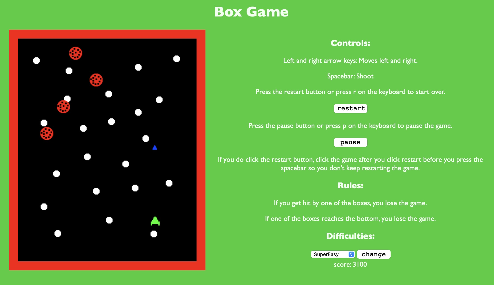

# BoxGame

This is a simple javascript game that is similar to galaga.

It is an endless shooter where you shoot down enemy sprites until you get hit or until one reaches the bottom.

Name of the game comes from the fact that before I added sprites, you played as a box shooting other boxes.

## Files/Folders

- game.js: JavaScript file containing game loop, player & enemy classes, etc.
- game.html: html wrapper for game.js
- style.css: Style for game.html
- images: Contains sprites used by game.js